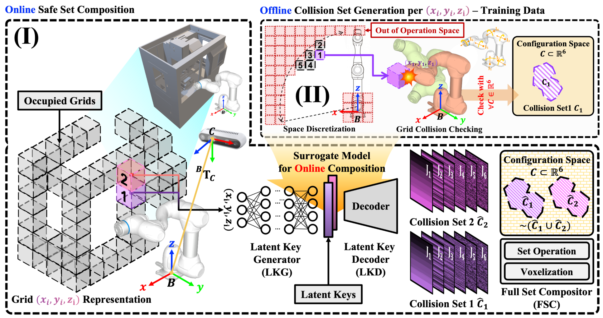

<p align="center">

</p>

# EASEIR
EASEIR: Efficient and Adaptive Safe-set Estimation via Implicit Representation for High-dimensional Motion Planning



Authors: [Hojun Lee](https://kidpaul94.github.io/), [Yuseop Sim](https://yuseopsim.github.io), Changheon Han, [Jiho Lee](https://www.jiholee.xyz/people), [Aniket Bera](https://www.cs.purdue.edu/homes/ab), [Martin B.G. Jun](https://web.ics.purdue.edu/~jun25/members.html)

[](https://opensource.org/licenses/MIT)

## TBD

## Citation
If you found EASEIR useful in your research, please consider citing:

```plain
@inproceedings{lee2025easeir,
  title={EASEIR: Efficient and Adaptive Safe-set Estimation via Implicit Representation for High-dimensional Motion Planning},
  author={Lee, Hojun and Sim, Yuseop and Han, Changheon and Lee, Jiho and Bera, Aniket and Kim, Changju and Jun, Martin Byung-Guk},
  booktitle={2025 IEEE/RSJ International Conference on Intelligent Robots and Systems (IROS)},
  pages={11661--11668},
  year={2025},
  organization={IEEE}
}
```
